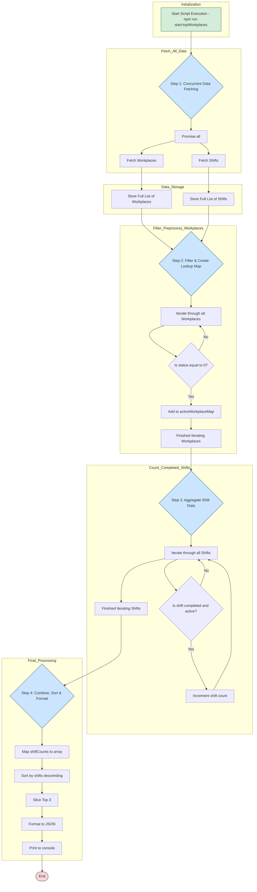

# Top Active Workplaces Scraper

This project is a solution for the "Fetch the Most Active Workplaces" assessment. The primary goal is to build a standalone TypeScript script that queries a running application's API, processes the data, and outputs the top 3 most active workplaces based on the number of completed shifts.

This document outlines the project's setup, the logic behind the solution, and the technical decisions made during implementation.

## Table of Contents

-   [Project Overview](#project-overview)
-   [Getting Started](#getting-started)
    -   [Prerequisites](#prerequisites)
    -   [Installation](#installation)
    -   [Running the Application & Script](#running-the-application--script)
-   [Solution Logic & Implementation Details](#solution-logic--implementation-details)
    -   [Step 1: Asynchronous Data Fetching with Pagination](#step-1-asynchronous-data-fetching-with-pagination)
    -   [Step 2: Data Modeling with TypeScript](#step-2-data-modeling-with-typescript)
    -   [Step 3: Filtering for Relevant Data](#step-3-filtering-for-relevant-data)
    -   [Step 4: Aggregating Shift Counts Efficiently](#step-4-aggregating-shift-counts-efficiently)
    -   [Step 5: Final Processing and Output Formatting](#step-5-final-processing-and-output-formatting)
-   [Technical Stack](#technical-stack)

## Project Overview

The core task was to address a business need from a Product Manager: to identify the top customers (Workplaces) for user feedback. The metric for "most active" was defined as **the number of completed shifts**. The solution had to be a script that could be run locally against the production application's API without modifying the existing API.

The final script, located at `src/scripts/top-workplaces.ts`, performs this task and prints the result to the console in a strictly formatted JSON array.

## Getting Started

Follow these instructions to set up the project and run the script.

### Prerequisites

-   [Node.js](https://nodejs.org/) (v16 or later recommended)
-   [npm](https://www.npmjs.com/) (usually included with Node.js)

### Installation

1.  Clone the repository:
    ```bash
    git clone [YOUR_REPOSITORY_URL]
    cd [YOUR_REPOSITORY_DIRECTORY]
    ```

2.  Install the necessary dependencies:
    ```bash
    npm install
    ```

### Running the Application & Script

The script queries a live API. Therefore, the main application server must be running before you execute the script.

1.  **Start the application server** in one terminal window:
    ```bash
    npm start
    ```
    This will start the server, typically on `http://localhost:3000`.

2.  **Run the `topWorkplaces` script** in a *separate* terminal window:
    ```bash
    npm run start:topWorkplaces
    ```

If successful, the script will print the final JSON output to the console.

## Solution Logic & Implementation Details

Here is a detailed breakdown of the "what, why, and how" behind the script's implementation.

### Step 1: Asynchronous Data Fetching with Pagination

**What we did:** The first challenge was fetching the complete datasets for `/api/workplaces` and `/api/shifts`. The API uses pagination, meaning we get the data in "chunks" or "pages" and must make multiple requests to get everything.

**How and Why:**
-   We created a generic helper function, `fetchAllPaginatedData`, which takes an initial URL as input.
-   This function uses a `while` loop that continues as long as the API response includes a `links.next` URL. It fetches data from the current URL, adds the results to a master list, and then updates the URL for the next iteration.
-   This approach encapsulates the complex pagination logic, keeping our main function clean. We used `Promise.all` to call this helper for both workplaces and shifts concurrently, improving efficiency by not waiting for one full fetch to complete before starting the other.

### Step 2: Data Modeling with TypeScript

**What we did:** We defined TypeScript `interface` types for our core data objects (`Workplace`, `Shift`) and for the API's paginated response structure.

**How and Why:**
-   By creating interfaces like `Workplace` and `Shift`, we enforce a strict data structure. This provides compile-time type checking, prevents common bugs (e.g., typos in property names), and enables excellent autocompletion in code editors.
-   It makes the code self-documenting. A developer can immediately understand the expected shape of the data just by looking at the interfaces.

### Step 3: Filtering for Relevant Data

**What we did:** The script filters the raw data to isolate only the information relevant to the task: **active workplaces** and **completed shifts**.

**How and Why:**
-   **Active Workplaces:** Based on the data model (`status: number`), we established a rule that a workplace is active if its `status` is `0`. We first filter the list of workplaces to keep only these active ones.
-   **Completed Shifts:** Based on the `Shift` data model (`workerId: number | null`, `cancelledAt: string | null`), we defined a "completed shift" as one that has been assigned to a worker (`workerId` is not `null`) and has not been cancelled (`cancelledAt` is `null`). This logic is applied to every shift in the dataset.

### Step 4: Aggregating Shift Counts Efficiently

**What we did:** We needed an efficient way to count the completed shifts for each active workplace.

**How and Why:**
-   We used a JavaScript `Map` to store the shift counts (`shiftCounts = new Map<number, number>()`). The map's key is the `workplaceId`, and its value is the running total of completed shifts.
-   A `Map` was chosen over a plain JavaScript object because it is optimized for frequent additions and lookups, providing better performance on large datasets. It also provides a cleaner, more explicit API (`.get()`, `.set()`, `.has()`).
-   To associate counts with workplace names later, we also created a map for active workplaces (`activeWorkplaceMap = new Map<number, string>`) to store `id -> name` pairs. This allows for an efficient O(1) average time complexity lookup.

### Step 5: Final Processing and Output Formatting

**What we did:** The final step involves combining our processed data, sorting it, and formatting it exactly as required by the assessment.

**How and Why:**
1.  **Combine:** We iterate through our `shiftCounts` map. For each `workplaceId`, we retrieve the workplace `name` from our `activeWorkplaceMap` and create a final result object: `{ name: string, shifts: number }`.
2.  **Sort:** We use the `Array.prototype.sort()` method with a custom comparator function (`(a, b) => b.shifts - a.shifts`) to sort the results in descending order.
3.  **Select:** We use `Array.prototype.slice(0, 3)` to select only the top three workplaces from the sorted list.
4.  **Format:** We use `console.log(JSON.stringify(data, null, 2))` to print the final array. The `null, 2` arguments ensure the JSON is "pretty-printed" with a 2-space indentation, matching the required output format precisely.

## Technical Stack

-   **Language:** [TypeScript](https://www.typescriptlang.org/)
-   **Runtime:** [Node.js](https://nodejs.org/)
-   **HTTP Client:** [Axios](https://axios-http.com/) (for making requests to the API)
-   **Package Manager:** [npm](https://www.npmjs.com/)




    style R fill:#cce5ff,stroke:#004085
```

